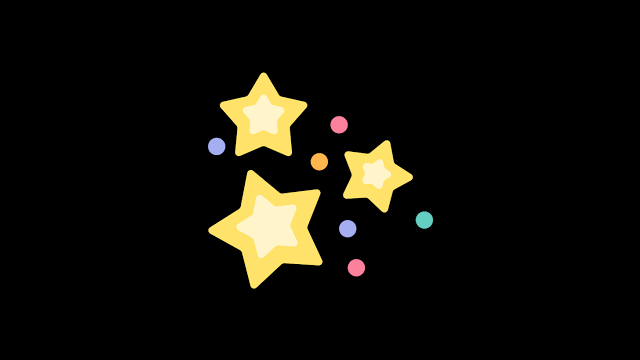
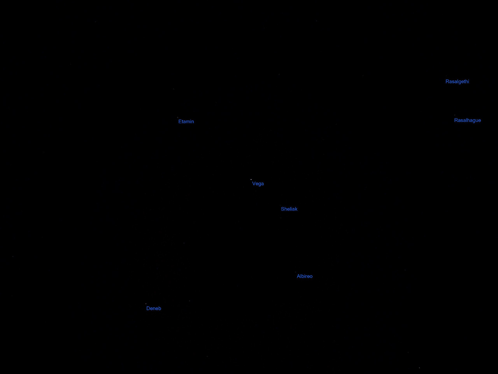
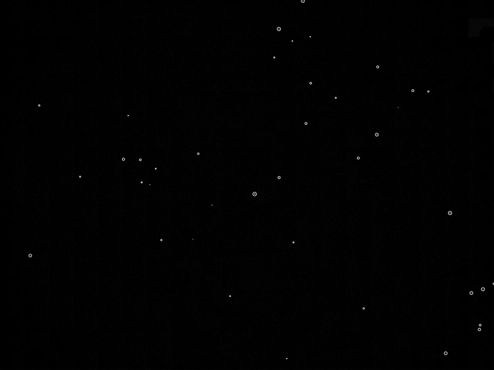

# Звездный ассистент - Бот основанный на GihaChat
  
- Бот умеет по фотографии определять звезды и подписывать по координатам. 
- По звезде, которая ближе всего к центру, бот напишет подробную справку из Gigachat и предоствит 5 самых свежих научных статей на выбор.
- Статьи бот берет с сайта arxivxplorer.com в реальном времени и переводит на русский язык с помощью GigaChat.
- После загрузки фотографии реализовано созхранение контестка и возможность спрашивать факты по звезде у GigaChat.
- Полностью проработан и реализован пользовательский путь.

[Ссылка](https://t.me/starScannerBot) на запущенного бота.

Для успешного тестирования нужно иметь фотографии звездного неба.
В проекте представлены 3 тестовые фотографии: [test1_vega.jpg](test1_vega.jpg), [test2_procion.jpg](test2_procion.jpg) и [test3_pollux.jpg](test3_pollux.jpg). Любую из них нужно закинуть в [бота](https://t.me/starScannerBot). После этого бот активируется и сможет проявить свои возможности.

[Видео](https://www.youtube.com/watch?v=WjBd5zXtdVU) демонстрирует работу бота. 
)

## Коротко как работает определение звезд по фото
Сначала изображение проходит через сверточную нейронную сеть. Сеть определяет индекс звезды в центре экрана. На вход сети подается примерно 30 самых ярких звезд из фото. С сохранением яркости, но в сжатом размере 256 x 256 пикселей. Таким образом алгоритм понимает участок неба для сопоставления.
Теперь по координатам всех известных звезд в этом регионе гененируется синтетический участок неба. Для матчинга с реальной картиной.

В идеальном мире сопосотавление работало бы примрено так: 

Но в реальных условиях, половины тусклых звезд может не хватать, а какие-то очень тусклые звезды, которых нет в синтетическом наборе могут проявится в реальном снимке и пришлось заморочиться.

Алгоритм сопоставления хранится в файле [common_points.py](common_points.py) Ищутся шаблоны в точках по углам и растояниям между ними. Учтены погрешности и все размеры вычисляются в относительных величинах. В конце своей работы алгоритм находит общие структуры и шаблоны. Если их достаточное количество, то значит сопоставление удалось и дальше можно подписывать координаты звезд. 

## Почему алгоритм работает так долго?

Весь алгоритм работает примерно 15 секунд. Но шаги перечисляные выше занимают не более 2 секунд на обычном CPU. Остальную часть времени алгоритм ищет необходимое количество звезд применяя различные Treshhold при бинаризации изображения. Этот шаг для поиска оптимального Treshhold может занять до 10 итераций. Данный шаг можно проработать, но в силу ограниченного количества времени на хакатоне никак не успеть это сделать.

